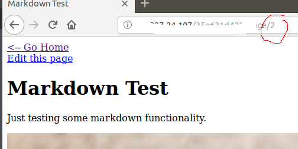

# Other Link

Đầu tiên nhìn kĩ vào chỉ số  index của page ta thấy nó là 1 số nguyên.

Vậy nên thử mình thử chạy brute force xem có gì lạ không.

Dựa vào kết quả trả về có duy nhất index = 7 bị Forbidden( Không có quyền)

Vậy nội dung của page có index = 7 sẽ chưa 1 điều gì đó.

Để ý thêm 1 chút mọi page đều có edit riêng của nó và điều trùng hợp là đường dẫn đều có dạng là 

http://xxx.xxx.xxx.xxx/xxxx/page/edit/1

http://xxx.xxx.xxx.xxx/xxxx/page/edit/2

Vậy biết đâu chúng ta bị 403 ở page/7 nhưng lại accept ở page/edit/7 thì sao?

Voila easy flag