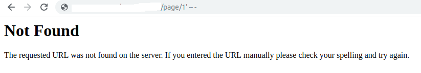
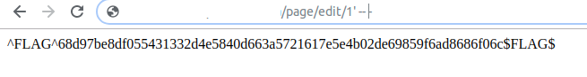

# MAYBE INJECTION

## Nhìn lướt qua thấy các trang đc lấy theo index

    ..../page/index

    Ngay cả edit cũng lấy dựa vào index

    ..../page/edit/index
 
    index được ko?

## Thử với /page/index và /page/edit/index  vói kí tự đơn giản ' -- -

Với kí tự này thì /page/index thông báo lỗi 404.

Tuy nhiên dễ dàng lấy đc flag ở /page/edit/index
