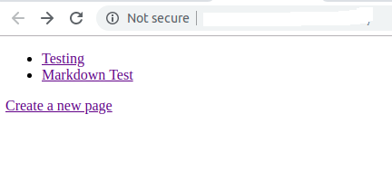
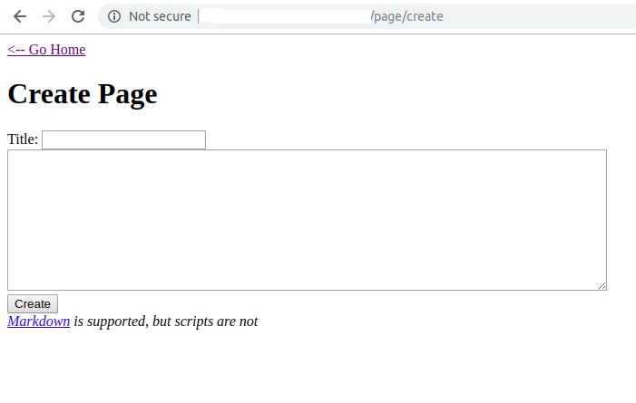

# XSS

## index



## Create a new page



Tôi thử tạo 1 trang mới xem cách hoạt động của web

và dưới đây là kết quả


Back về home


Dự đoán Sau khi tạo trang ta có thể  xss ở 2 nơi.
1. page
2. home

Thử tạo lại và sử dụng xss:
1. xss đơn giản nhất:
```js
<script> alert(1)</script>
```
Kết quả:

Tại page:

Không hiển thị gì

Back về home

Flag đã hiện thị ở trên popup

