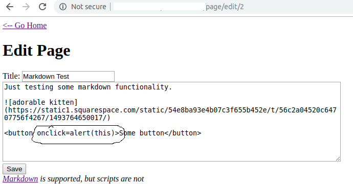
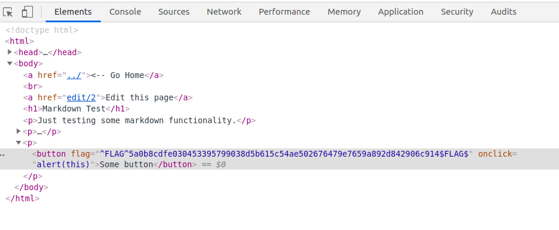

# XSS

Thử XSS 1 cách khác không dùng thẻ script. Sử dụng các thuộc tính có sẵn trên các thẻ html như onload, onclick, onerror. . .

Cụ thể trong
/page/2
tiện có thẻ button ta thử  xss bằng cách sử dụng onclick

Checking elements chúng ta sẽ thấy được flag

