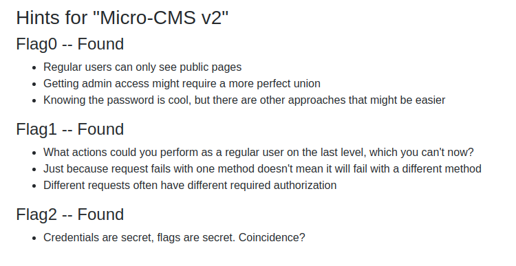

#Micro-CMS-v2

## FLAG

|flag   | link   |
|-------|----------|
|flag0  | [Link flag0](flag0/README.md) |
|flag1  | [Link flag1](flag1/README.md) |
|flag2  | [Link flag1](flag2/README.md) |

## HINTS

